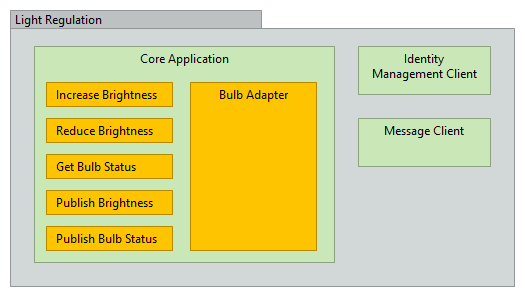

# Decomposition View

The purpose of this document is to explain the decomposition view of the light regulation system and its components.
The _Light Regulation_ System consits of three main parts:
1. [Core Application](#Core-Application)
2. [Identity Management System Client](#Identity-Management-System-Client)
3. [Message Client](#Message-Client)

## Core Application
The _core application_ is the light regulation's "brain". It processes and evaluates all inputs of the system.  
The data exchange with the bulbs is established via the [bulb adapter](#Bulb-Adapter).  
Before a command is executed, the [identity management system client](#Identity-Management-System-Client) is used to ensure the sender of the command is authorized to execute the proposed action.
To communicate with other parts of the BM system the [message client](#Message-Client) is used. It establishes a connection to the overall monitoring desk as well as among the other modules itself.

### Bulb Adapter
In order to retrieve data from bulbs so called _smart bulbs_ are used. Those can send information about the light brightness and whether the bulb is broken or not. There exist various different companies that produce those bulbs and consequently many different communication protocols. In order to handle this variety of devices the _bulb adapter_ is introduced.  
This sub-module of the core application enables to communication to smart bulbs of different manufacturers. It implements different company dependent protocols and translates them to the core applications' own protocol. With this implementation the core application can communicate with several different bulbs. Also the end user now can choose the smart bulb he/she likes.

## Identity Management System Client
The identity management system client enables access to the identity management system. With this client the core application can retrieve information whether the user is authenticated to execute a command or not.

## Message Client
The message client can be used to send data of bulbs to the monitoring desk, that visualizes all the data of the different BM modules. Further it establishes also data exchange among the modules.
